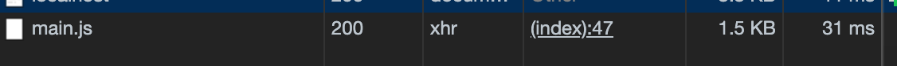

# diffupdate-webpack-plugin

这是一个产生js 文件版本差分数据的webpack 插件，当浏览器请求一个js 资源时，若本地存在缓存，则会与差分数据进行合并，否则会下载全量js 文件并缓存；

## 为什么要使用它？
在大多数情况下，当我们迭代开发时，更改的内容一般并不多，但由于chunk hash 改变，客户端需要重新下载全量文件，即便我们分包之后也会存在这一问题，对服务端的请求和客户的等待都是不必要求的。

但如果我们通过差分合并文件，那么我们只需要一个差分信息并将其与本地缓存合并起来。

**如下:**

如果客户端不存在缓存，或者缓存已经超过了限定的更新差，那么客户端将下载全量文件并缓存到本地


如果存在缓存，那么我们将读取一个 `__fileDiff__` 变量（由插件生成插入模板），然后与缓存合并，完成升级

## 安卓
```
npm install --save-dev diffupdate-webpack-plugin
```

在webpack 配置中（仅用于production 模式中，避免开发过程中产生不必要的缓存）。
```javascript
const DiffUpdate = require('diffupdate-webpack-plugin');
const HtmlWebpackPlugin = require('html-webpack-plugin'); // 必须与 html-webpack-plugin 一起使用
module.exports = {
  mode: 'production',
  entry: [
    './src/index.js',
    './src/main.js'
  ],
  output: {
    filename:'[name].js',
  },
  plugins: [
    new HtmlWebpackPlugin(),
    new DiffUpdate({
      limit: 4, // 默认为 3
    })
  ]
}
```
### 配置 
`exclude` String/Array - 需要跳过不缓存的文件，默认为`false`, 即引入所有文件，（不能与 `include` 选项同时使用);

`include` String/Array - 允许引入的文件，默认为`false`, 即引入所有文件，（不能与`exlude` 选项同时使用);

`limit` Number - 最大缓存版本限制，默认为 `3`;

## 已知问题
* 当css 不配置导出时会出现错误