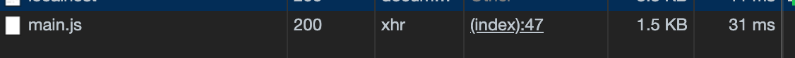
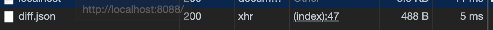

# diffupdate-webpack-plugin

A Webpack Plugin for diff update javascript via differencing file change & creating a `diff.json`, when front end request a javascript, if there has already had a cache, it will request `diff.json` to patch update, or it will download the javascript file & cache it;

## Why I should use it?
In most cases, when we change a javascript file, even it is just few change, the chunk hash will change, and the client side needs to download the new file, What a waste!

But if we update the file by patching diff, what we need is downloading a file that describe difference infomation, and merge it with the local cache, we will save many request data & get things faster.

**see below:**

if client side has no cache or the cache is out of limited count, it will load the full javascript file & cache it.

if it has a cache, it will request `diff.json` to get the diff info, then patch change & merge it.


1.5K vs 400B, we made it! 

## Installation
```
npm install --save-dev diffupdate-webpack-plugin
```

in you webpack config (use it in production mode)
```javascript
const DiffUpdate = require('diffupdate-webpack-plugin');
// const path = require('path');
module.exports = {
  mode: 'production',
  entry: [
    './src/index.js',
    './src/main.js'
  ],
  output: {
    filename:'[name].js',
    // path: path.resolve(__dirname, './build'),
  },
  plugins: [
    new DiffUpdate()
  ]
}
```

insert the code below in your template html, then execute `loadScript(['main.js'])` to load file;
```javascript
!function(){function h(e,t){var n="";t=JSON.parse(t);for(var a=0,o=0;o<t.length;o++){var r=t[o];if("number"!=typeof r){if("string"==typeof r){if("+"===r[0]){var i=r.slice(1,r.length);n+=i,e=e.slice(0,a)+i+e.slice(a+i.length),a+=i.length}if("-"===r[0])a+=parseInt(r.slice(1,r.length))}}else n+=e.slice(a,a+r),a+=r}return n}function a(e,t){var n=new XMLHttpRequest;n.open("GET",e),n.onload=function(){var e=this.responseText;t&&t(e)},n.send()}function g(t){a(t,function(e){window.eval(e),localStorage.setItem(t,JSON.stringify({hash:window.__fileHash,source:e}))})}window.loadScript=function(e){for(var t=0,n=e.length;t<n;t++){var l=e[t];if(localStorage.getItem(l)){var f=JSON.parse(localStorage.getItem(l)),c=f.hash;a("diff.json",function(e){for(var t,n,a=(e=JSON.parse(e))[l],o=0,r=a.length;o<r;o++){var i=a[o];i.hash===c&&(t=i.diff,n=i.hash)}if(t){var s=h(f.source,t);window.eval(s),localStorage.setItem(l,JSON.stringify({hash:n,source:s}))}else g(l)})}else g(l)}}}();
```